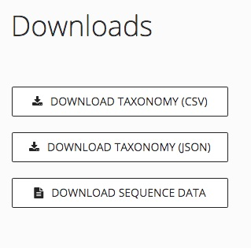
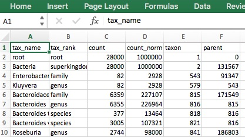
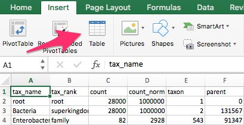
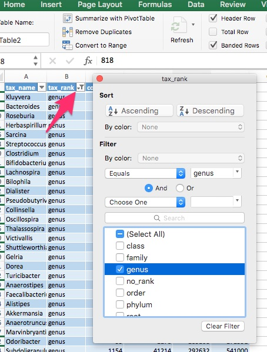

# Working with your uBiome data

After uBiome receives your sample, our lab technicians carefully process it in a state-of-the-art Illumina NextSeq 500 gene sequencing machine that turns it into a computer-readable format called FASTQ which is further analyzed to produce the following three files, available on the downloads section of the 'Advanced' tab in the Microbiome Explorer:
 


The FASTQ is in the button "Download Sequence Data" and clicking it will give you a very large series of files compressed in a ZIP format. This is the raw data, and it is *very* raw. We'll discuss FASTQ later, but for now just be aware that this contains all the information that any professional bioinformatics scientist can use about your sample. In fact, this is the file that uBiome crunches to produce the taxonomy files you'll get when you click the other two buttons.

## A short review of biology

To understand taxonomy files, it's helpful to review some elementary biology. You may have learned in a grade school science class that biologists divide all living things into several large categories, called taxonomical ranks, according to a scheme first proposed by the Swedish botanist Carl Linnaeus in the 1700s. From the most broad to the most specific, these ranks are Kingdom, Phylum, Class, Order, Family, Genus, and Species. Humans, for example, are:

| tax_rank| tax_name     | 
|---------|--------------| 
| Kingdom | Animalia     | 
| Phylum  | Chordata     | 
| Class   | Mammalia     | 
| Order   | Primate      | 
| Family  | Hominidae    | 
| Genus   | *Homo*       | 
| Species | *H.* sapiens | 

Whenever you see a bacterium named on a uBiome site or in the taxonomy files, you should always pay attention to the rank, and remember that ranks can be extremely broad. Most people want to know whether a bacteria is "good" or "bad", but depending on the rank, that question is as meaningless as asking whether, say, Animals or Chordates (vertebrates) are "good" or "bad". In fact, even at the more narrow Genus rank that question usually isn't terribly useful. After all, the genus *Canus* includes not just loveable Beagles and Collies, but coyotes and wolves too. 
 
# uBiome taxonomy files

FASTQ files have no taxonomy in them at all, so to make the results useful, the uBiome computers generate a summary based on a series of proprietary algorithms. You can download that summary in one of two forms, either as a CSV file easily readable by a spreadsheet program like Excel, or as a JSON text file that can be processed by a programming language like Python.

Both CSV and JSON files come with a set of fields like these:

**tax_name**: this is the classification of the organism based on the level of its taxonomy. If you were looking at a human being, for example, you would see homo sapiens if you selected tax_rank = species, but you’d see mammalia if you selected tax_rank = class.

**count**: an absolute measure of the number of organisms found in the sample. Without knowing the size of the sample, or how many times the DNA inside was processed through PCR amplification, this number doesn’t mean much except in relation to other counts at the same taxonomical rank.

**count_norm**: a “normalized” version of the count, based on some uBiome number-crunching, but you can think of it as parts per million: each unit is 1 / 10,000th of a percent.

**tax_rank**: tells the level of the taxonomy. In daily conversation about animals or plants, we usually refer to the species (e.g. homo sapiens), but sometimes it’s more useful to talk about bigger groupings of related organisms. For example, humans are members of the class mammalia, along with tigers and horses. If this spreadsheet were counting organisms at the level of class mammalia, the count_norm would almost certainly be bigger than the count_norm for humans alone, unless humans were the only type of mammal found in the sample.  

**taxon** and **parent**: these help identify the ranking in a more precise way by pointing out which tax_ranks are subsets of which. For example, Bacteroidia above has a parent = 976, meaning that it is a subset of the taxon 976, Bacteroidetes. When you follow the various taxons and parents up the chain, you’ll see they all end in the superkingdom Bacteria, which has a taxon of 2. The values for these numbers, incidentally, are taxonomical numbers from the curated database at NCBI, the national bioinformatics center run by the U.S. government. Enter the number into the taxonomy browser at the [NCBI Taxonomy Browser](http://www.ncbi.nlm.nih.gov/Taxonomy/Browser/wwwtax.cgi?mode=Undef&id=2&lvl=3&srchmode=1&keep=1&unlock) and you can learn as much as you want about that organism.

**tax_color** doesn’t matter for this analysis, but uBiome software uses this to colorize some of the graphs to make them more readable.

Getting to know these taxonomy fields is not very complicated and soon it will be second nature.

# Using the uBiome CSV file

For most people, the CSV file is most useful because it can be immediately read into a spreadsheet like Excel, where it will look something like this:



On Mac Excel, you can turn this into a table, by pressing this button:



and then you can easily filter and sort by clicking the upside down triangle in the header rows of the table, to see this pop-up:



If you're familiar with basic spreadsheet operations, you'll find it easy to sort and filter and even graph your results. Some uBiome users combine their spreadsheet views with data from other sources, such as a food diary or exercise information. Go ahead and experiment!

# Analyze your results in Python

For even more powerful analysis, click 'Download Taxonomy (JSON)' for a taxonomy summary file that contains information suitable for reading into a programming language like Python.

The open source [ubiome Tools Repository](https://github.com/ubiome-opensource/microbiome-tools) contains programming tools that can get you started with the following:

* Compare two samples to find the unique organisms in each.
* Compare two samples and show the differences in counts for each.
* Merge more than one sample into a single large spreadsheet.

If you are already familiar with the basics of Python programming, see the script [ubiome_example.py](https://github.com/ubiome-opensource/microbiome-tools/blob/master/ubiome_example.py) for a complete example.


## Compare two samples


### Command line version (easiest)

If you are familiar with how to use the console application on your computer (the ```Terminal``` application on a Mac, or ```Powershell``` on a Windows PC), you can use this library from the command line.

Download the 'ubiome' folder to a directory where you have two uBiome taxonomy files you want to compare.

Hint: on a Macintosh, you can download the correct files with the following command:

    $ svn export https://github.com/ubiome-opensource/microbiome-tools/trunk/ubiome ubiome

(this will create the folder ```ubiome``` in your current directory).

```
> python -m ubiome -h
```
You should see the following:

```
usage: ubiome.py [-h] [-c COMPARE] [-u UNIQUE] [-d DEBUG] sample1 sample2

positional arguments:
  sample1               filename for a valid uBiome JSON taxonomy file
  sample2               sample you are comparing to

optional arguments:
  -h, --help            show this help message and exit
  -c COMPARE, --compare COMPARE
                        Compare sample1 with with sample2
  -u UNIQUE, --unique UNIQUE
                        Find items in sample1 not in sample2
  -d DEBUG, --debug DEBUG
                        turn debug mode to run tests

```                      

To compare two samples, type:

```

> python -m ubiome -c sample1.json sample2.json
```

You will see several lines of comma-separated values indicating the difference in `count_norm` values between the two samples.

You can also type the following to save the results to the file "compare12.csv"

```
> python -m ubiome -c sample1.json sample2.json > compare12.csv
```

Similarly, to see the unique organisms in one sample compared to the other, type:

```
> python -m ubiome -u sample1.json sample2.json

```

## Module version (requires knowledge of Python)

Download the enclosed 'ubiome' directory to make the ```ubiome``` module available on your computer (either Python 2 or 3).

A simpler way, if you have the PIP command available on your system:

    $ pip install ubiome

to download the uBiome Python library from the Python Package Index.

This will create a new system command, ```ubiome``` that works like this:

    $ ubiome -c sample1.json sample2.json
 
 to compare two samples and send the results to standard output.
 
 The following example assumes you downloaded two uBiome JSON files into your current directory, like this:

    $ ls

    sample1.json  sample2.json  x.csv

Run the following series of commands in your Python 2+ or 3+ console:

    $ python

    >>> from ubiome import *
    >>> x1 = UbiomeSample("sample1.json")
    >>> x2 = UbiomeSample("sample2.json")
    >>> x = UbiomeMultiSample(x1)
    >>> x.merge(x2)
    >>> # continue to merge as many additional samples as you like
    >>> x.write("x.csv")

Now your directory will have a new file ```x.csv``` with all samples merged. The first row is all the taxons ever found in your samples, and the other columns are your different samples, with rows containing the `count_norm` for every taxon.


