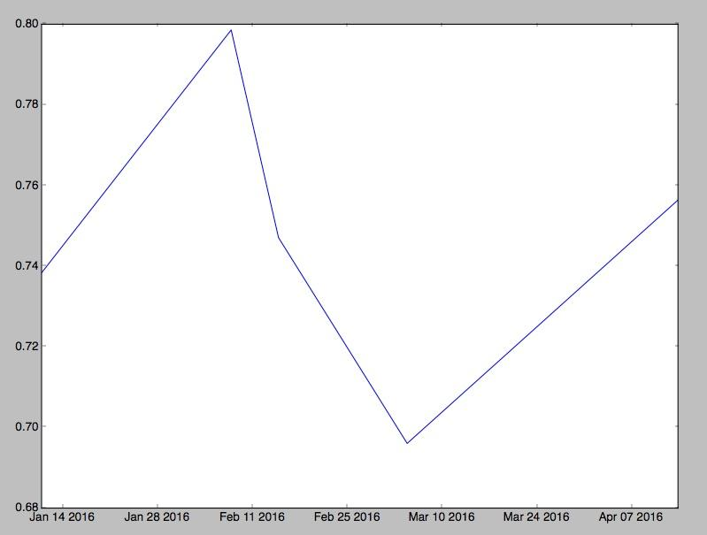

# Analyze your uBiome Results in Python

by [Richard Sprague](http://twitter.com/sprague)

The charts and tables you see in the [uBiome Explorer](https://app.ubiome.com/explore) are generated from the same data file that you can download for yourself in the Advanced tab. If you’re comfortable with programming, you can pull that data into your favorite software tools for even more analysis. 

To get started, look at the open source [uBiome Tools Repository](https://github.com/ubiome-opensource/microbiome-tools) which contains source code that will let you:

* Compare two samples to find the unique organisms in each.

* Compare two samples and show the differences in counts for each.

* Merge more than one sample into a single file.

For Python programmers, the code is available either in our library or as an easy-to-install library hosted on the [Python Package Index](https://pypi.python.org/pypi/ubiome) and installable through PIP. Just type this from the console application on your computer (either Terminal on Mac, or Powershell on Windows).

	$ pip install ubiome

The uBiome package is designed for either Python 2 or 3, and once installed you can use it as a console script, for a new system command like this:

	> ubiome -h
	
	usage: ubiome.py [-h] [-c COMPARE] [-u UNIQUE] [-d DEBUG] sample1 sample2
	
	positional arguments:
	  sample1               filename for a valid uBiome JSON taxonomy file
	  sample2               sample you are comparing to
	
	optional arguments:
	  -h, --help            show this help message and exit
	  -c COMPARE, --compare COMPARE
	                        Compare sample1 with with sample2
	  -u UNIQUE, --unique UNIQUE
	                        Find items in sample1 not in sample2
	  -d DEBUG, --debug DEBUG
	                        turn debug mode to run tests

If you have two uBiome-formatted JSON files in the current directory, try this:

	$ ubiome -c sample1.json sample2.json

It will compare the two samples and output a comma-separated (CSV) dump of the differences between them.  Similarly, the following command returns the parts of a sample that are unique:

	$ ubiome -u sample1.json sample2.json > uniques.csv

Now you’ll have a new file in your directory, "uniques.csv", that you can load into any spreadsheet program. The file will have a series of rows representing each taxa of bacteria that are unique, i.e. only found in “sample1.json”.

You’ll find both the compare and unique commands useful for understanding the differences between two of your own samples. If you have a sample of yourself before taking probiotics, and another afterwards, for example, this can help you tell what organisms changed and by how much.

The uBiome package can of course be imported into Python as the basis of your own scripts and modules. To see how, run the following series of commands in your Python 2+ or 3+ console:

	$ python
	
	>>> from ubiome import *
	>>> x1 = UbiomeSample("sample1.json")
	>>> x2 = UbiomeSample("sample2.json")
	>>> x = UbiomeMultiSample(x1)
	>>> x.merge(x2)
	>>> # continue to merge as many additional samples as you like
	>>> x.write("x.csv")

Now your directory will have a new file ‘x.csv’ with all samples merged. The first row is all the taxons ever found in your samples, and the other columns are your different samples, with rows containing the **count_norm **value for every taxon, including zero values for those taxa that are missing in a particular test.

The merged form, called a **UbiomeMultiSample**, can do even more. For example, continue to merge a few more samples in the example above, and then run this code:

	samples = x.originalSampleObjects # just the UbiomeSample objects of the merged items
	
	diversity = [sample.diversity() for sample in samples]
	
	dates = [sample.date for sample in samples]
	
If you have matplotlib on your system and run this:
	
	plot(dates,diversity)

You will see this chart that plots the diversity of a series of samples over time:

See the script [ubiome_example.py](https://github.com/ubiome-opensource/microbiome-tools/blob/master/ubiome_example.py) for a complete example. We have also included a number of user-supplied JSON files for you to try if you want to test your own code on real samples.

Please let us know when you make your own interesting analysis and as always, ask us if you have any questions.

